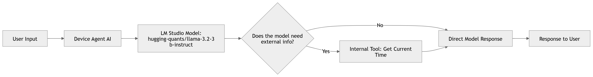

# Device Agent AI

An **intelligent agent** that leverages the **Hugging Face quantized model** `hugging-quants/llama-3.2-3b-instruct` hosted on **LM Studio** to answer user queries. For tasks where the model cannot access real-time information (like the current time), it automatically invokes an **internal tool** to provide accurate responses.

---

## Features

- Chat with a **local LLaMA 3.2B instruct model** using **LM Studio**  
- Custom **tool integration** for real-time data (e.g., current time)  
- Asynchronous agent execution for fast responses  
- Fully modular: easily add more tools in the future  

---

## Architecture / Workflow

## Project Structure

device-agent-ai/
├─ main.py               # Entry point for the agent
├─ src/
│  ├─ agent.py           # Agent logic and orchestration
│  ├─ model.py           # LM Studio model interface
│  └─ tools.py           # Internal tools (e.g., current time)
├─ requirements.txt      # Python dependencies
└─ README.md